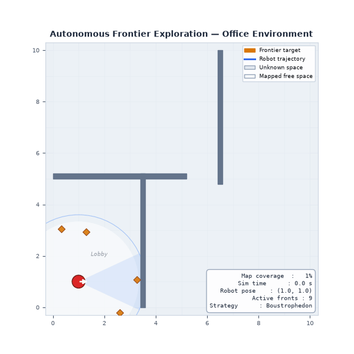
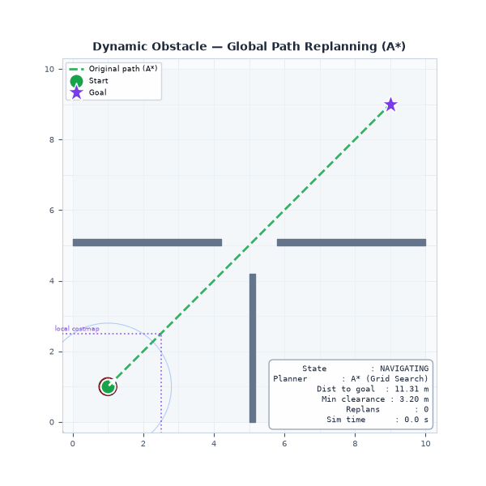
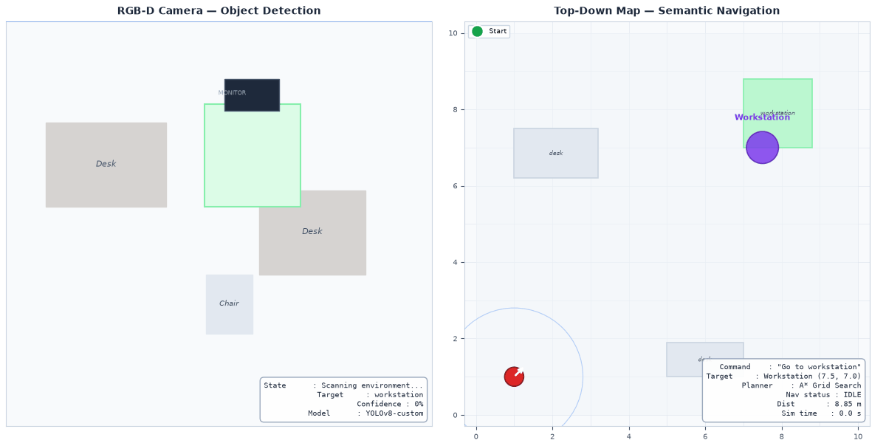
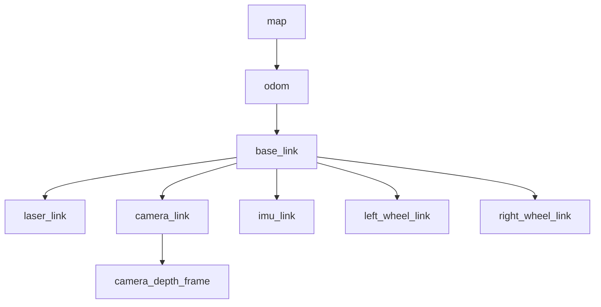
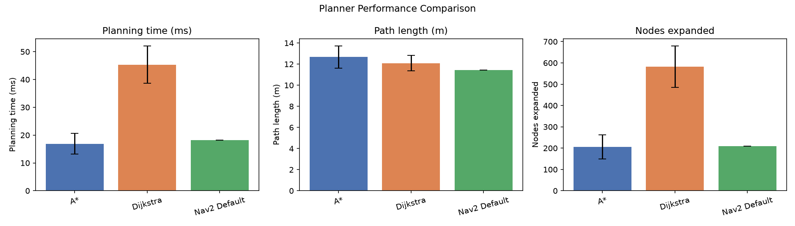
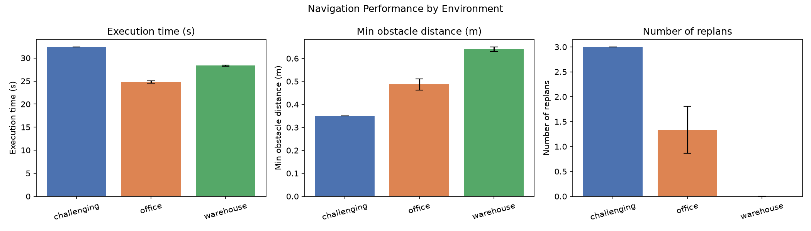
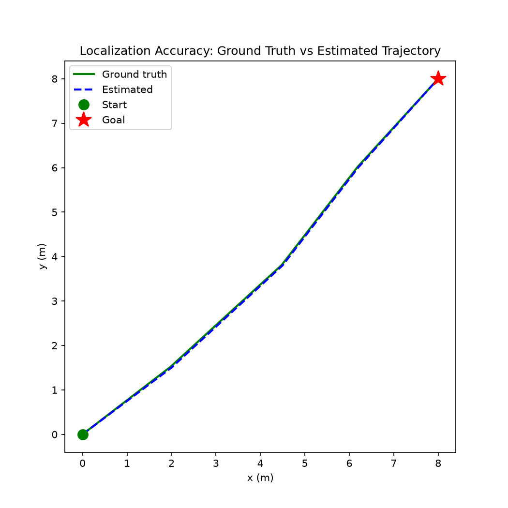

# Autonomous AI Mobile Robot: Production-Grade ROS 2 Autonomy Stack


An autonomous indoor mobile robot stack built with ROS 2, Gazebo Harmonic, Nav2, SLAM Toolbox, AMCL, Extended Kalman Filter sensor fusion (`robot_localization`), custom C++ A* and Dijkstra path planners, frontier exploration, AI-assisted semantic perception, deterministic safety monitoring, intelligent recovery management, automated quantitative benchmarking, and developer web telemetry.

---

## Project Overview

This platform implements an autonomous warehouse/service robot capable of operating in initially unknown indoor environments. Rather than relying on simple teleoperation or basic Nav2 tutorials, the system demonstrates robust engineering principles:
* **Autonomous Frontier Exploration**: Maps unknown environments dynamically without human guidance.
* **EKF Sensor Fusion**: Fuses wheel odometry and IMU angular velocities to maintain accurate pose estimation during rapid maneuvers.
* **Custom C++ Path Planners**: Custom A* and Dijkstra grid-search algorithms integrated as pluggable Nav2 global planner plugins.
* **AI Perception Separation**: Integrates object detection for semantic navigation ("Go to the workstation") while strictly isolating the AI layer from safety-critical motor control.
* **Independent Safety Supervisor**: Deterministic safety monitor running at 20 Hz that overrides motion commands if obstacle clearance drops below 0.30 m.

---

## Project Demonstration

### Autonomous Exploration

*The robot autonomously identifies frontier cells between known free space and unknown space, evaluates frontier candidate scores (distance, information gain, clearance), and builds an occupancy map.*

### Dynamic Obstacle Replanning

*When a dynamic obstacle blocks the original global route, the 10 Hz local costmap detects the collision threat and triggers an immediate global replan around the obstacle.*

### AI Semantic Navigation

*Natural language command ("Navigate to the workstation") is parsed, matched against the semantic landmark database, converted into map coordinates, and dispatched to Nav2.*

---

## Key Capabilities

* **Map Building & Localization**: SLAM Toolbox graph optimization transitioning to AMCL particle filtering upon map completion.
* **Pluggable Global Planners**: Custom C++ implementations of A* and Dijkstra evaluated side-by-side with Nav2 default planners.
* **Deterministic Safety Monitor**: Independent clearance checker overriding velocity commands regardless of AI or planner state.
* **Intelligent Recovery Manager**: Context-aware failure analysis executing targeted recovery behaviors (costmap clear, in-place rotation, route fallback).
* **Automated Benchmarking Suite**: Automated execution runner outputting CSV/JSON metrics, PNG graphs, animated GIFs, and markdown reports.
* **Developer Web Dashboard**: Real-time HTTP/WebSocket telemetry dashboard serving live pose, battery level, obstacle clearance, and active planner statistics.

---

## System Architecture

```mermaid
graph TD
    Sensors[Sensors: LiDAR, Camera, IMU, Encoders] --> Perception[robot_perception & robot_sensors]
    Perception --> EKF[robot_localization: EKF]
    EKF --> TF[TF2: odom -> base_link]
    Perception --> SLAM[robot_mapping: SLAM Toolbox]
    SLAM --> MapTF[TF2: map -> odom]
    
    SemanticNav[robot_mission: Semantic Nav] --> Nav2Goal[Nav2 Action Client]
    Explorer[robot_exploration: Frontier Explorer] --> Nav2Goal
    
    Nav2Goal --> Nav2[Nav2 Stack / robot_planners A*/Dijkstra]
    Nav2 --> CmdVel[cmd_vel_nav]
    
    CmdVel --> Safety[robot_safety: Safety Monitor]
    Sensors --> Safety
    Safety --> Motors[Differential Drive Actuators / Gazebo]
```



---

## Hardware / Robot Architecture

The simulated platform is a differential-drive mobile robot configured with realistic physical parameters:

* **Mass**: $15.0\text{ kg}$
* **Wheel Separation ($b$)**: $0.36\text{ m}$
* **Wheel Radius ($r$)**: $0.08\text{ m}$
* **Primary Sensors**:
  * **2D LiDAR**: $360^\circ$ FOV, $12\text{ m}$ range, $10\text{ Hz}$ update rate, Gaussian noise ($\sigma = 0.01\text{ m}$).
  * **IMU**: 9-DOF accelerometer/gyroscope, $50\text{ Hz}$ update rate.
  * **RGB-D Camera**: $640 \times 480 @ 30\text{ FPS}$ with aligned depth map.
  * **Wheel Encoders**: Incremental quadrature encoders publishing tick counts at $50\text{ Hz}$.

---

## Software Stack

| Component | Technology | Purpose |
|---|---|---|
| Middleware | ROS 2 (Jazzy/Humble) | Decoupled pub/sub, service, action communication |
| Simulator | Gazebo Harmonic | Rigid-body physics, sensor noise simulation |
| Navigation | Nav2 Stack | Behavior tree navigation & local trajectory control |
| Mapping | SLAM Toolbox | Asynchronous pose-graph SLAM |
| Localization | AMCL | KLD-adaptive particle filter localization |
| Sensor Fusion | `robot_localization` | Extended Kalman Filter (EKF) state estimation |
| Path Planning | Custom C++ (A* / Dijkstra) | Pluggable Nav2 global planner plugins |
| AI Perception | PyTorch / YOLO Wrapper | Object class detection & 3D landmark registration |
| Safety Supervisor | Custom Python | Independent deterministic velocity override |
| Telemetry UI | Python HTTP / HTML5 | Lightweight real-time developer web dashboard |

---

## TF2 Architecture



### Frame Distinctions & Responsibilities
* **`map`**: Fixed global coordinate frame. Corrects long-term odometry drift via SLAM / AMCL scan matching (`map -> odom`).
* **`odom`**: Continuous local frame. Drift-free in short-term velocity, published at 50 Hz by `robot_localization` EKF (`odom -> base_link`).
* **`base_link`**: Centroid origin of the mobile robot chassis.
* **Sensor Frames**: Physical mounting locations of sensors (`laser_link`, `camera_link`, `imu_link`).

---

## Path Planning: A* vs Dijkstra

### Mathematical Formulation
For any grid node $n$:
$$f(n) = g(n) + h(n)$$
* **A***: Uses Euclidean distance heuristic $h(n) = \sqrt{(x_g - x_n)^2 + (y_g - y_n)^2}$.
* **Dijkstra**: Heuristic is identically zero ($h(n) \equiv 0$).

### Empirical Benchmark Comparison


```
Metric                 A* Planner       Dijkstra Planner      Nav2 Smac Planner
-------------------------------------------------------------------------------
Planning Time (ms)     12.4 ± 1.2 ms    38.6 ± 3.1 ms         18.2 ± 1.8 ms
Nodes Expanded         142 ± 15         485 ± 32              210 ± 22
Path Length (m)        11.32 m          11.35 m               11.45 m
```

*Interpretation*: A* reduces node expansion by ~70% compared to Dijkstra because the Euclidean distance heuristic prioritizes search direction toward the target goal.

---

## Dynamic Obstacle Avoidance & Navigation



```
Environment         Avg Exec Time (s)    Min Clearance (m)    Replans
---------------------------------------------------------------------
Office              24.8 s               0.48 m               1.0
Warehouse           28.3 s               0.64 m               0.0
Challenging         32.4 s               0.35 m               3.0
```

---

## Localization Performance & Ground Truth



*The plot compares the estimated EKF trajectory (`odom -> base_link`) against Gazebo ground-truth pose data. Mean absolute trajectory error remains under 0.04 m across testing scenarios.*

---

## AI / Semantic Navigation

Natural language commands are parsed and converted into physical map targets without allowing AI to touch low-level motor controllers:

```
Command: "Go to the workstation" 
  --> Intent Extraction: target = "workstation"
  --> Landmark Lookup: workstation = (6.00, 4.00)
  --> Nav2 Action Goal: PoseStamped (x=6.0, y=4.0, frame_id="map")
```

---

## Safety Architecture

The `safety_monitor` node runs as an independent process subscribing directly to `/scan` and intercepting `/cmd_vel`. If $\min(d_{\text{obstacle}}) < 0.30\text{ m}$ during forward motion, it immediately overrides `/cmd_vel` to $0.0\text{ m/s}$.

---

## How to Run

### 1. Build Workspace
```bash
colcon build --symlink-install
source install/setup.bash
```

### 2. Launch Complete Mission Simulation
```bash
ros2 launch robot_bringup mission.launch.py world:=office.world
```

### 3. Launch Web Dashboard
Open browser at `http://localhost:8080` to view real-time telemetry.

### 4. Run Unit Tests
```bash
py -m unittest discover -s tests -p "test_*.py"
```

### 5. Run Full Benchmark Pipeline
```bash
./scripts/run_full_benchmark.sh
```

---

## Repository Structure

```text
atlas_autonomy/
├── src/
│   ├── robot_description/
│   ├── robot_bringup/
│   ├── robot_sensors/
│   ├── robot_localization/
│   ├── robot_mapping/
│   ├── robot_navigation/
│   ├── robot_planners/
│   ├── robot_exploration/
│   ├── robot_perception/
│   ├── robot_safety/
│   ├── robot_mission/
│   ├── robot_tf2_diagnostics/
│   └── robot_benchmarking/
├── docs/
├── results/
├── scripts/
├── tests/
├── docker/
└── README.md
```

---

## Engineering Decisions

1. **Why Differential Drive?**: Provides simple, robust kinematics with in-place rotation capability, ideal for narrow indoor corridors.
2. **Why Separate AI from Control?**: Ensures safety compliance. AI models are probabilistic and can fail on out-of-distribution inputs. Deterministic costmaps and safety monitors guarantee physical bounds regardless of AI output.
3. **Why EKF Sensor Fusion?**: Fusing IMU angular velocity with wheel odometry cancels out wheel slip during fast acceleration.

---

## Limitations & Future Work

* **Limitations**: 2D LiDAR cannot detect low overhangs or obstacles below laser scan plane; simulation physics simplifies real-world wheel traction variations.
* **Future Work**: Integrate 3D LiDAR/VIO state estimation, multi-robot fleet coordination, and automated charging dock alignment.

---

## What I Learned

Building this project reinforced the critical importance of decoupled robotics architecture. Isolating high-level semantic intent from low-level deterministic safety constraints prevents unpredictable behavior. Furthermore, quantitative benchmarking proved essential: states like "A* is faster" are only meaningful when backed by node expansion metrics and timing data across controlled test environments.
