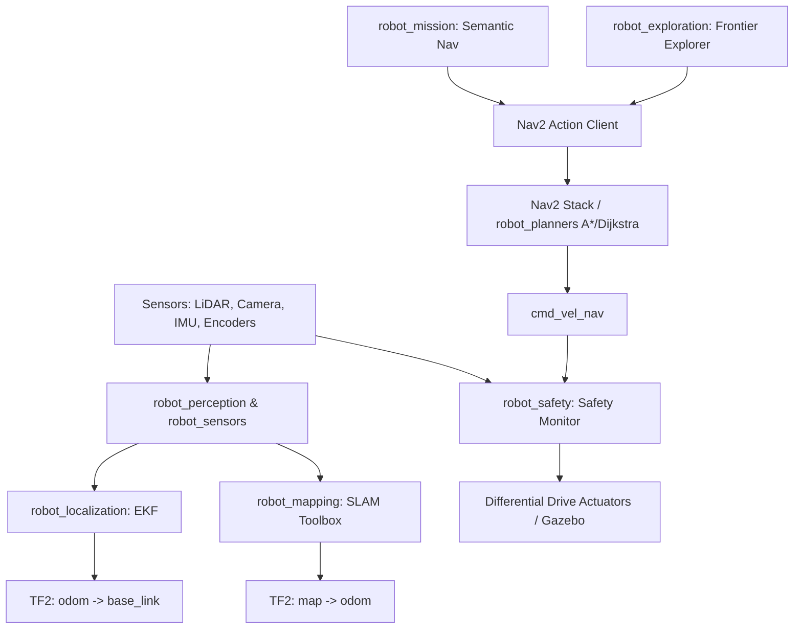

# System Architecture

## Overview

The Autonomous Mobile Robot uses a modular ROS 2 architecture with clear separation between perception, state estimation, navigation, motion control, and safety. High-level mission logic is kept separate from the lower-level control stack, while the safety layer runs independently so it can intervene when necessary.

## Core Subsystems

### 1. Perception & Sensor Filtering (`robot_sensors`, `robot_perception`)

* **LiDAR Processing**: Raw `/scan` data is filtered for valid range limits and simulated sensor noise.
* **AI Perception**: RGB-D camera frames are passed through the object detection model wrapper, with detected objects added to the 3D semantic world model.

### 2. State Estimation & SLAM (`robot_localization`, `robot_mapping`)

* **EKF Fusion**: Wheel odometry and IMU angular velocity are fused using the `robot_localization` EKF to produce a smoother `odom -> base_link` transform.
* **SLAM Toolbox**: Builds the 2D occupancy grid and publishes the `map -> odom` transform to account for accumulated odometry drift.

### 3. Motion Planning & Control (`robot_planners`, `robot_navigation`)

* **Global Planning**: Pluggable C++ A* and Dijkstra planners operate on the global costmap.
* **Nav2 Behavior Trees**: Handles the navigation control flow, including planning, execution, and recovery behaviors.

### 4. Deterministic Safety Layer (`robot_safety`)

* **Safety Monitor**: Runs independently from the AI and navigation layers, subscribing directly to `/scan` and the commanded velocity. It overrides the current command if obstacle clearance falls below the configured threshold (0.30 m).

### 5. Semantic Interface & Recovery (`robot_mission`)

* **Semantic Nav**: Converts high-level natural language goals into physical coordinates on the map.
* **Recovery Manager**: Monitors navigation failures such as blocked paths and spikes in localization covariance, then triggers the appropriate recovery sequence.
