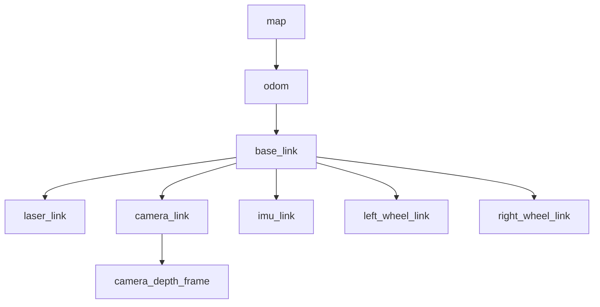

# Coordinate Frames & TF2 Architecture

## Coordinate Tree Topology

## Transform Publisher Responsibility

| Transform Edge | Publishing Node | Source Data | Frequency |
|---|---|---|---|
| `map -> odom` | `slam_toolbox` / `amcl` | Scan matching / Particle filter drift correction | 1 - 5 Hz |
| `odom -> base_link` | `robot_localization` (EKF) | Wheel Encoders + IMU Fusion | 50 Hz |
| `base_link -> laser_link` | `robot_state_publisher` | Static URDF offset | Static |
| `base_link -> camera_link` | `robot_state_publisher` | Static URDF offset | Static |
| `base_link -> imu_link` | `robot_state_publisher` | Static URDF offset | Static |

## Transform Distinctions

### `map` vs `odom` Frame
- **`odom`**: Continuous, smooth frame. Subject to unbounded physical drift over long distances due to wheel slip, but locally consistent and drift-free in velocity.
- **`map`**: World-fixed discrete frame. Corrects odometry drift via global map matching (SLAM or AMCL). Has discrete pose jumps when localization updates occur.

### Sensor Frames vs `base_link`
Sensor frames (`laser_link`, `camera_link`) represent physical mounting locations of sensors relative to the robot origin (`base_link`). Treating sensor observations as if they originated at `base_link` causes severe geometric parallax errors in obstacle placement and costmap generation.

## Launch-Time Validation
The `robot_tf2_diagnostics` node inspects frame connectivity, tree continuity, latency, and unexpected transforms at launch time to prevent navigation failures caused by missing TF trees.
